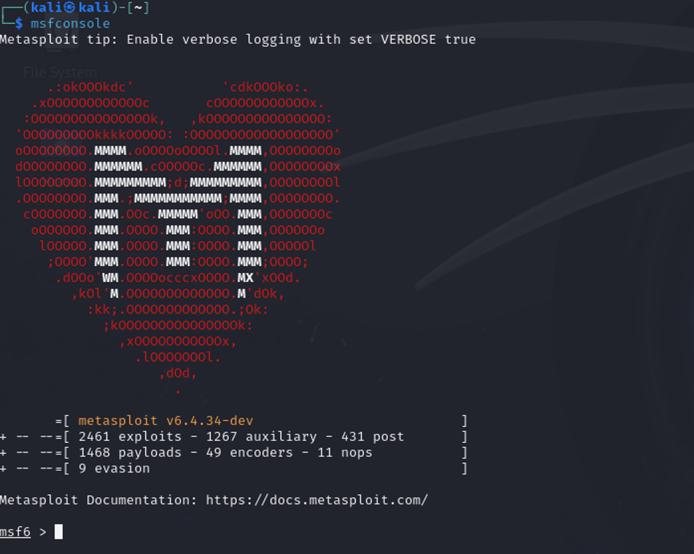
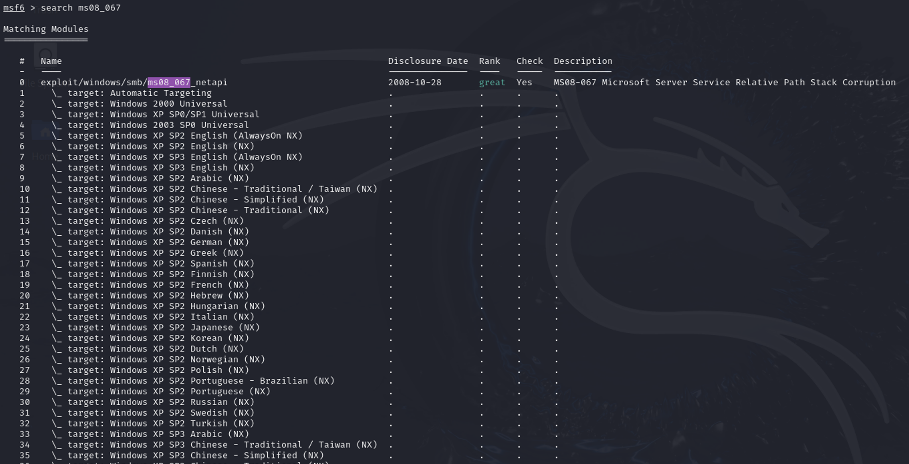
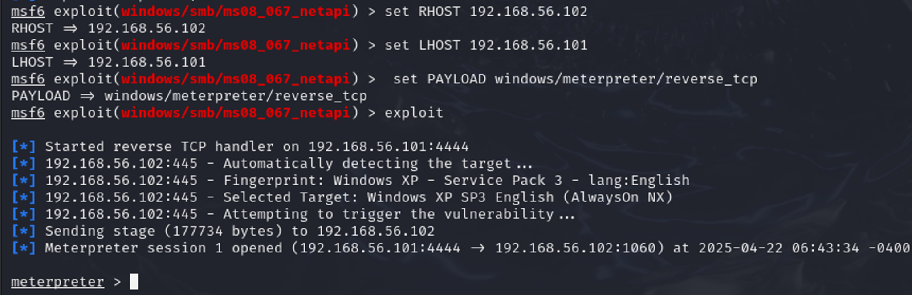

# MS08-067 Penetration Testing Lab

A hands-on penetration testing lab demonstrating the exploitation of the **MS08-067 Microsoft Server Service vulnerability** using **Kali Linux**, **Nmap**, and **Metasploit Framework** against a vulnerable **Windows XP SP3** virtual machine.

---

## Overview

This project demonstrates the complete penetration testing workflow, including:

- Target reconnaissance
- Port scanning with Nmap
- Exploit discovery using Metasploit
- Successful exploitation of MS08-067
- Post-exploitation verification

> **Disclaimer:** This project was performed in a controlled laboratory environment for educational purposes only.

---

## Lab Environment

| Component | Version |
|-----------|----------|
| Attacker Machine | Kali Linux |
| Target Machine | Windows XP SP3 |
| Exploitation Framework | Metasploit |
| Scanner | Nmap |
| Virtualization | VirtualBox |

---

## Tools Used

- Kali Linux
- Nmap
- Metasploit Framework
- Windows XP SP3
- VirtualBox

---

## Attack Workflow

1. Configure the lab environment.
2. Discover the target host.
3. Scan the SMB service (Port 445).
4. Search for the MS08-067 exploit.
5. Configure the exploit parameters.
6. Launch the exploit.
7. Gain Meterpreter access.
8. Perform post-exploitation verification.

---

# Screenshots

## 1. Target Scanning


Scanning the target machine using **Nmap** to verify that the SMB service is accessible.

---

## 2. Starting Metasploit



Launching the Metasploit Framework.

---

## 3. Exploit Selection



Searching for the **MS08-067 NetAPI** exploit module.

---

## 4. Successful Exploitation



Configuring the exploit parameters and successfully opening a Meterpreter session.

---

## 5. Post Exploitation


Verifying successful access by collecting target system information using **sysinfo**.

---

## Skills Demonstrated

- Vulnerability Assessment
- Network Reconnaissance
- Port Scanning
- Exploit Identification
- Metasploit Framework
- Meterpreter
- Post Exploitation
- Ethical Hacking
- Penetration Testing
- Cybersecurity Lab Practice

---

## Repository Structure

```
MS08-067-Penetration-Testing-Lab
│
├── images/
│   ├── scanning.png
│   ├── metasploit-console.png
│   ├── exploit-selection.png
│   ├── successful-exploitation.png
│   └── post-exploitation.png
│
└── README.md
```

---

## Author

**Shujun Alsaif**

Information Security Graduate

University of Hail

LinkedIn:
https://www.linkedin.com/in/shujun-alsaif

GitHub:
https://github.com/shjoonfahad
