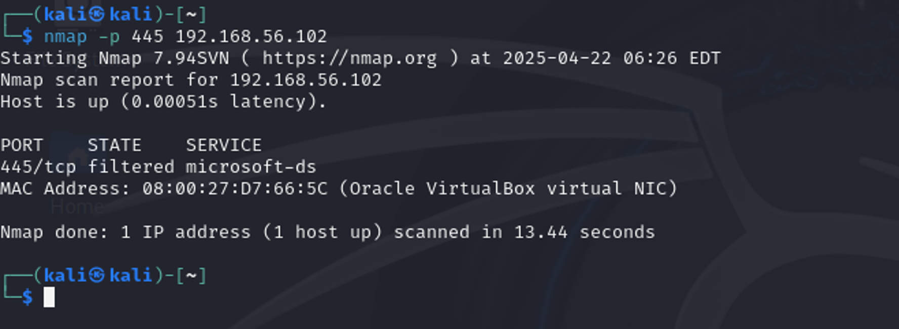
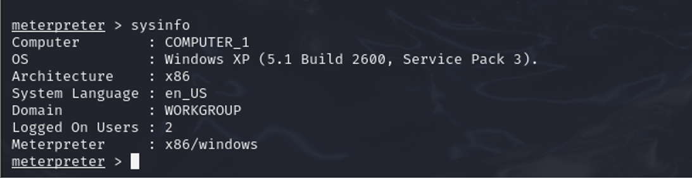

# 🛡️ MS08-067 Penetration Testing Lab

A hands-on ethical hacking lab demonstrating exploitation of the MS08-067 vulnerability using the Metasploit Framework in a controlled virtual environment.

---

## 📌 Project Overview

This project demonstrates the complete penetration testing workflow against a vulnerable Windows XP machine affected by the MS08-067 SMB vulnerability.

The objective was to identify the vulnerable service, exploit it using Metasploit, establish a Meterpreter session, and perform post-exploitation activities within an isolated lab environment.

---

## ⚠️ Disclaimer

This project was conducted in an authorized laboratory environment for educational purposes only.

---

## ✨ Features

- Network Reconnaissance
- SMB Service Enumeration
- MS08-067 Exploitation
- Meterpreter Session
- Remote Command Execution
- System Enumeration
- Screenshot Capture
- Process Enumeration

---

## 🛠 Technologies Used

- Kali Linux
- Metasploit Framework
- Nmap
- Meterpreter
- Windows XP SP2
- VirtualBox

---

## 📂 Lab Workflow

1. Scan the target using Nmap.
2. Identify SMB service.
3. Load the MS08-067 exploit.
4. Configure payload.
5. Execute the exploit.
6. Obtain Meterpreter session.
7. Perform post-exploitation.
8. Document the results.

---

## 📸 Screenshots

### Target Scanning

### Metasploit Configuration

### Meterpreter Session

### Post Exploitation

---

## 📄 Presentation

The project presentation is included in this repository.

📄 **ISEC364_202103624_Presentation.pptx**

---

## 📈 Results

- Successfully exploited the MS08-067 vulnerability.
- Established a Meterpreter session.
- Performed system enumeration.
- Demonstrated post-exploitation techniques.
- Highlighted the importance of patch management.

---

## 👩‍💻 Author

**Shujun Alsaif**

Information Security Graduate

University of Hail

LinkedIn:
https://www.linkedin.com/in/shujun-alsaif

GitHub:
https://github.com/shjoonfahad
